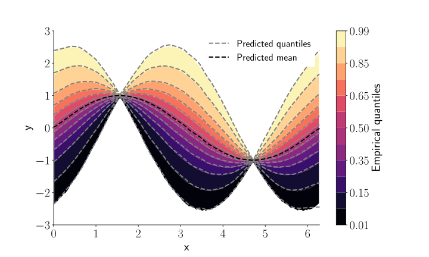

.. quantnn documentation master file, created by
   sphinx-quickstart on Sun Dec  6 10:44:55 2020.
   You can adapt this file completely to your liking, but it should at least
   contain the root `toctree` directive.

quantnn
=======

The **quantnn** package provides an implementation of **quantile regression neural
networks (QRNNs)** in Python. QRNNs can be used to estimate the epistemic uncertainty
in a regression task by learning to predict the quantiles :math:`y_\tau` of the conditional
distribution :math:`p(y | \mathbf{x})`.

   Example of a QRNN applied to predict the quantiles of a function :math:`y` with heteroscedastic
   noise.

.. toctree::
   :maxdepth: 2
   :caption: Contents:

   getting_started
   examples

