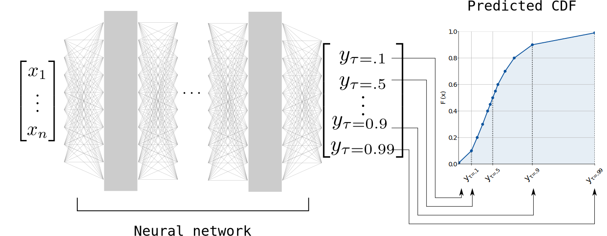

===========================================
Quantile regression neural networks (QRNNs)
===========================================

Given an input vector :math:`\mathbf{x}` with input features :math:`x_1, \ldots,
x_n`, a QRNN learns to predict a sequence of quantiles :math:`y_\tau` of the
distribution :math:`P(y | \mathbf{x})`. Since these quantiles correspond to the inverse
:math:`F^{-1}` of the cumulative distribution function :math:`F(x) = P(X \leq x
| Y = y)`, the QRNN output can be interpreted as a piece-wise linear
approximation of the CDF of :math:`P(y|x)`.

  A QRNN is a neural network which predicts a sequence of quantiles of
  the posterior distribution :math:`P(y|x)`.

How it works
------------

QRNNs make use of quantile regression to learn to predict the quantiles of the
distribution :math:`P(y|x)`. This works because the quantiles :math:`y_\tau` for
given quantile fractions :math:`\tau \in [0, 1]` correspond to minima of the
expected value :math:`\mathbf{E}_y {\mathcal{L}_\tau(y, y_\tau)}` of the quantile loss function

.. math::

   \mathcal{L}_\tau(y, y_\tau) =
      \begin{cases}
      \tau (y - y_\tau) & \text{if } y > y_\tau \\
      (1 - \tau) (y_\tau - y) & \text{otherwise}.
      \end{cases}

A proof of this can be found on `wikipedia <https://en.wikipedia.org/wiki/Quantile_regression>`_.

Because of this property, training a neural network using the quantile loss
function :math:`\mathcal{L}_\tau` will teach the network to predict the
corresponding quantiles :math:`y_\tau`. QRNNs extend this principle to a
sequence of quantiles corresponding to an arbitrary selection of quantile
fractions :math:`\tau_1, \tau_2, \ldots` which are optimized simultaneously.

Defining a model
----------------

To define a QRNN model you need to specify the quantiles to predict as well as the
architecture of the underlying network to use. The code snippet below shows how
to create a QRNN model to predict the first until 99th percentiles.

As neural network model the QRNN uses fully-connected neural network with four hidden
layers with 128 neurons each and ReLU activation functions. Since this is taken
from the simple example notebook, the number of input features is set to 1.

.. code ::

  from quantnn import QRNN
  quantiles = np.linspace(0.01, 0.99, 99)

  layers = 4
  neurons = 128
  activation = "relu"
  model = (layers, neurons, activation)

  qrnn = q.QRNN(quantiles, input_dimensions=1, model=model)

QRNN provides a simplified interface to create QRNNs with simple fully-connected
architectures. The QRNN class, however, doesn't restrict you to use a fully-connected
network but supports any other suitable architecture such as, for example, 
fully-convolutional DenseNet-type architecture:

.. code ::

  model = ... # Define model as Pytorch Module or Keras model object.
  qrnn = q.QRNN(quantiles, model)

Training
--------

Evaluation
----------

Saving and loading
------------------

